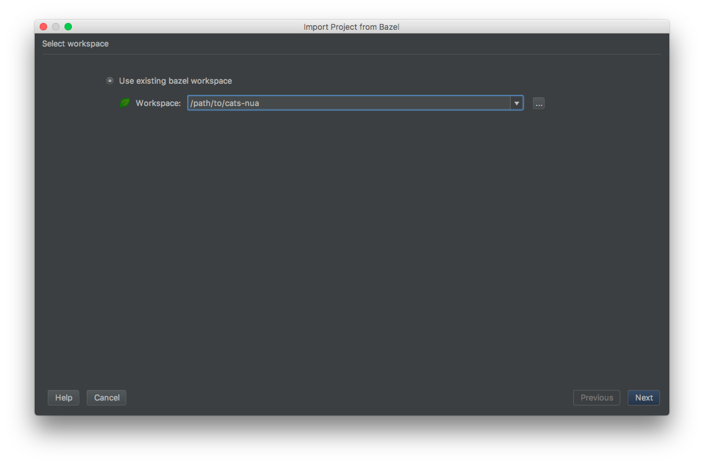
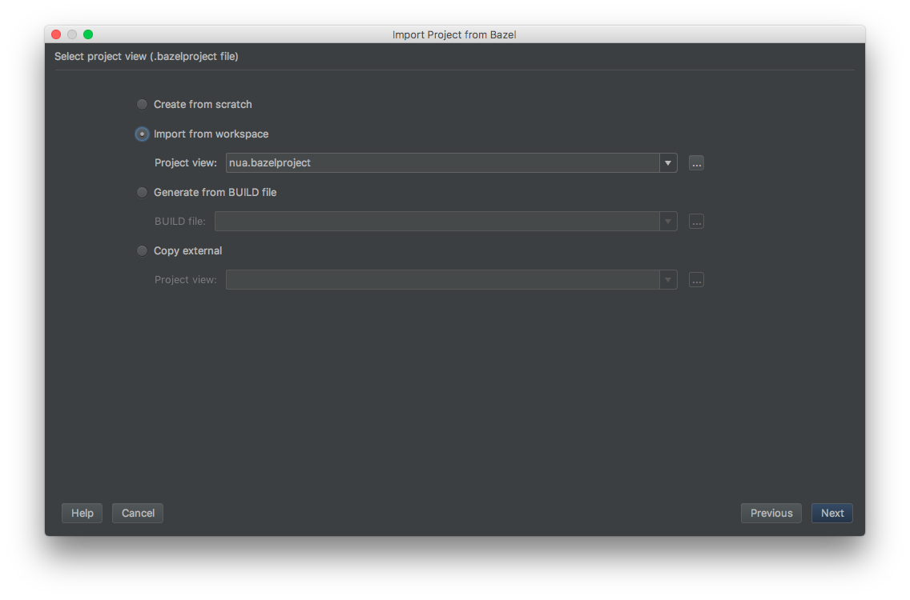
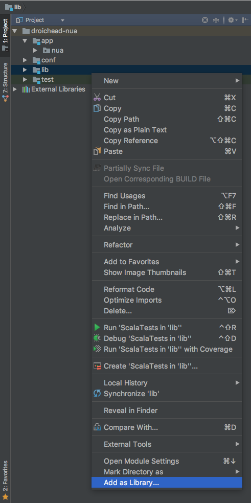
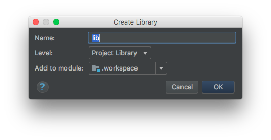
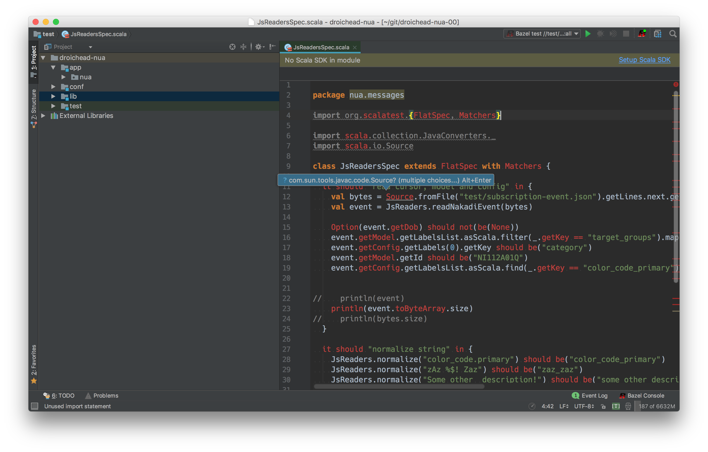
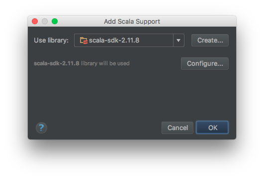
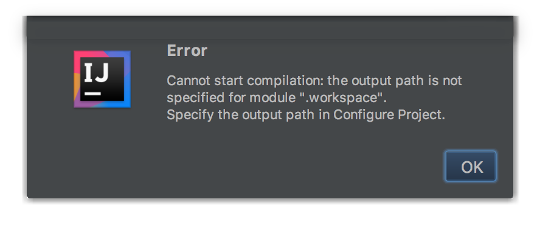
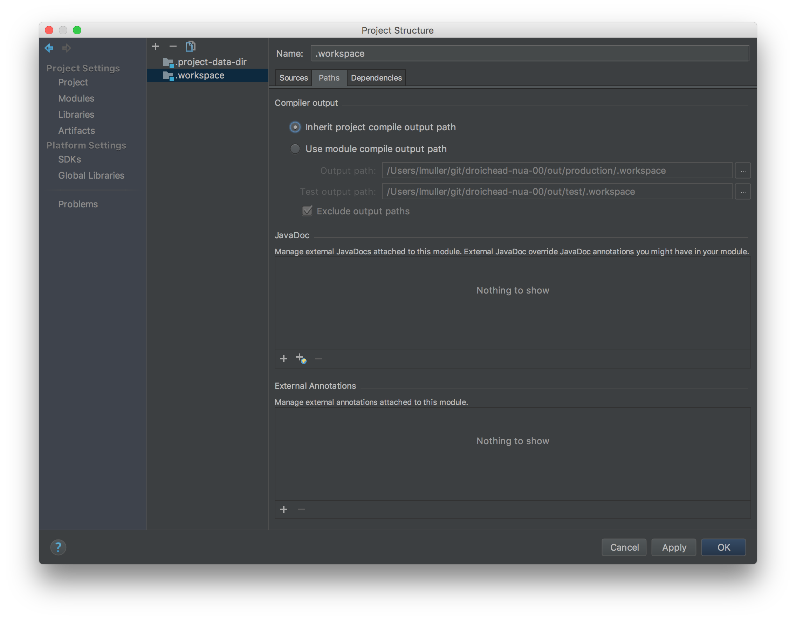

## IntelliJ setup

### Import Bazel Project

#### Select the workspace



#### Set the project view to `nua.bazelproject`



#### Setup dependencies

```bash
rm -rf lib
mkdir -p lib
bazel build intellij
tar xf bazel-bin/intellij/intellij.tar -C lib
```

#### Add Library...




#### Setup Scala SDK




Make sure to select `scala-sdk-2.11` otherwise you might get errors when running single tests from within IntelliJ.

#### Fix project structure

##### Error



##### Before


##### After



#### Changing Dependencies

When adding or removing dependencies, we need to also update the dependencies viewed by IntelliJ:
- Add or remove the dependency in question from `intellij/BUILD`
- [Refresh dependencies](#setup-dependencies)
- You may need to re-sync bazel (`IntelliJ -> Bazel -> Sync -> Sync Project with BUILD Files`) and follow the [above steps](#add-library) again
